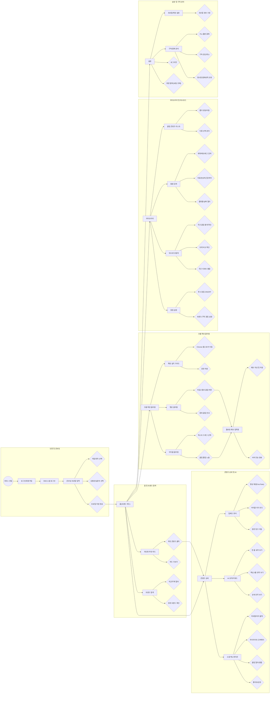

```mermaid
flowchart LR

  subgraph s1 ["인증 및 온보딩"]
    n1(("서비스 진입"))
    n2["로그인/회원가입"]
    n3["SNS 소셜 로그인"]
    n4["온보딩 프로필 입력"]
    n5{"직업/연차 선택"}
    n6{"상황/관심분야 선택"}
    n7{"프로필 저장 완료"}
  end

  subgraph s2 ["홈 및 트렌드 탐색"]
    n8["홈(트렌드 피드)"]
    n9["개인화 추천 피드"]
    n10{"추천 콘텐츠 클릭"}
    n11{"피드 더보기"}
    n12["트렌드 탐색"]
    n13{"직군/주제 필터"}
    n14{"또래 트렌드 확인"}
  end

  subgraph s3 ["크롬 확장 클리핑"]
    n15["크롬 확장 클리핑"]
    n16["확장 설치 가이드"]
    n17{"Chrome 웹스토어 이동"}
    n18{"권한 허용"}
    n19["영상 클리핑"]
    n20{"타임스탬프 클립 버튼"}
    n21{"중복 클립 안내"}
    n22["아티클 클리핑"]
    n23{"텍스트 드래그 선택"}
    n24{"클립 툴팁 노출"}
    n25["플로팅 메모 입력창"]
    n26{"메모 작성 및 저장"}
    n27{"서버 전송 완료"}
  end

  subgraph s4 ["콘텐츠 상세 및 AI"]
    n28["콘텐츠 상세"]
    n29["임베드 뷰어"]
    n30{"영상 재생(YouTube)"}
    n31{"아티클 리더 모드"}
    n32{"원본 링크 이동"}
    n33["AI 요약/키워드"]
    n34{"한 줄 요약 보기"}
    n35{"핵심 3줄 요약 보기"}
    n36{"상세 요약 보기"}
    n37["소셜 애노테이션"]
    n38{"히트맵/마커 클릭"}
    n39{"하이라이트 오버레이"}
    n40{"클립 필터/정렬"}
    n41{"좋아요/공유"}
  end

  subgraph s5 ["라이브러리 및 대시보드"]
    n42["라이브러리"]
    n43["클립 콘텐츠 리스트"]
    n44{"폴더 생성/이동"}
    n45{"다중 선택 관리"}
    n46["통합 검색"]
    n47{"제목/메모/태그 검색"}
    n48{"자동완성/최근검색어"}
    n49{"플랫폼/날짜 필터"}
    n50["대시보드/통계"]
    n51{"주간 클립 통계 확인"}
    n52{"또래 비교 확인"}
    n53{"주간 리포트 열람"}
    n54["알림 설정"]
    n55{"푸시 알림 ON/OFF"}
    n56{"트렌드/구독 알림 설정"}
  end

  subgraph s6 ["설정 및 구독 관리"]
    n57["프로필/계정 설정"]
    n58["설정"]
    n59{"프로필 정보 수정"}
    n60["구독/결제 관리"]
    n61{"Pro 플랜 결제"}
    n62{"구독 갱신/취소"}
    n63{"영수증/결제내역 조회"}
    n64{"로그아웃"}
    n65{"회원 탈퇴(30일 유예)"}
  end

  n1 --> n2
  n2 --> n3
  n3 --> n4
  n4 --> n5
  n4 --> n6
  n4 --> n7
  n7 --> n8
  n8 --> n9
  n9 --> n10
  n9 --> n11
  n8 --> n12
  n12 --> n13
  n12 --> n14
  n8 --> n15
  n15 --> n16
  n16 --> n17
  n16 --> n18
  n15 --> n19
  n19 --> n20
  n19 --> n21
  n15 --> n22
  n22 --> n23
  n22 --> n24
  n20 --> n25
  n24 --> n25
  n25 --> n26
  n25 --> n27
  n10 --> n28
  n8 --> n28
  n28 --> n29
  n29 --> n30
  n29 --> n31
  n29 --> n32
  n28 --> n33
  n33 --> n34
  n33 --> n35
  n33 --> n36
  n28 --> n37
  n37 --> n38
  n37 --> n39
  n37 --> n40
  n37 --> n41
  n8 --> n42
  n42 --> n43
  n43 --> n44
  n43 --> n45
  n42 --> n46
  n46 --> n47
  n46 --> n48
  n46 --> n49
  n42 --> n50
  n50 --> n51
  n50 --> n52
  n50 --> n53
  n42 --> n54
  n54 --> n55
  n54 --> n56
  n8 --> n58
  n58 --> n57
  n57 --> n59
  n58 --> n60
  n60 --> n61
  n60 --> n62
  n60 --> n63
  n58 --> n64
  n58 --> n65
```
